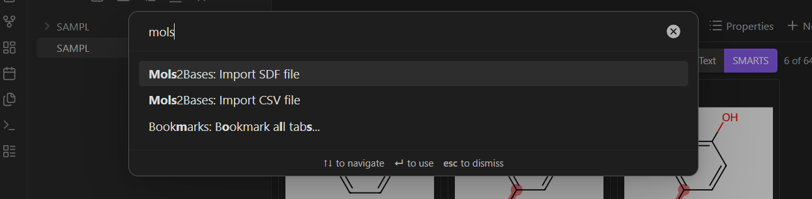
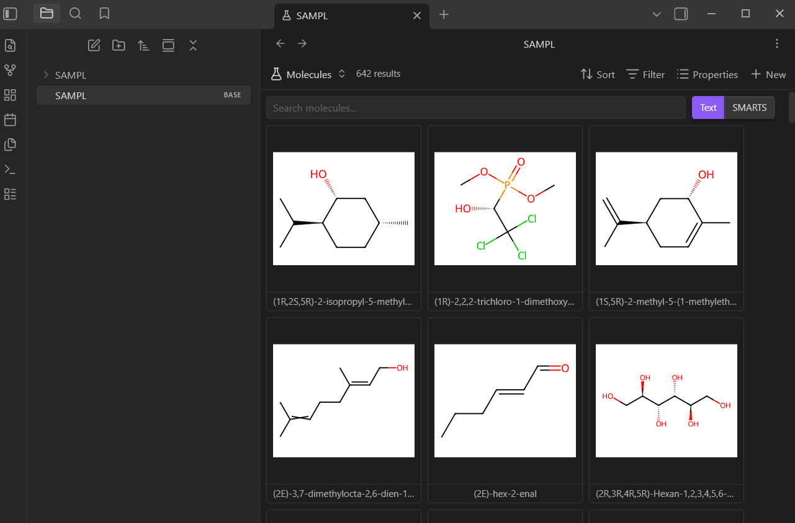
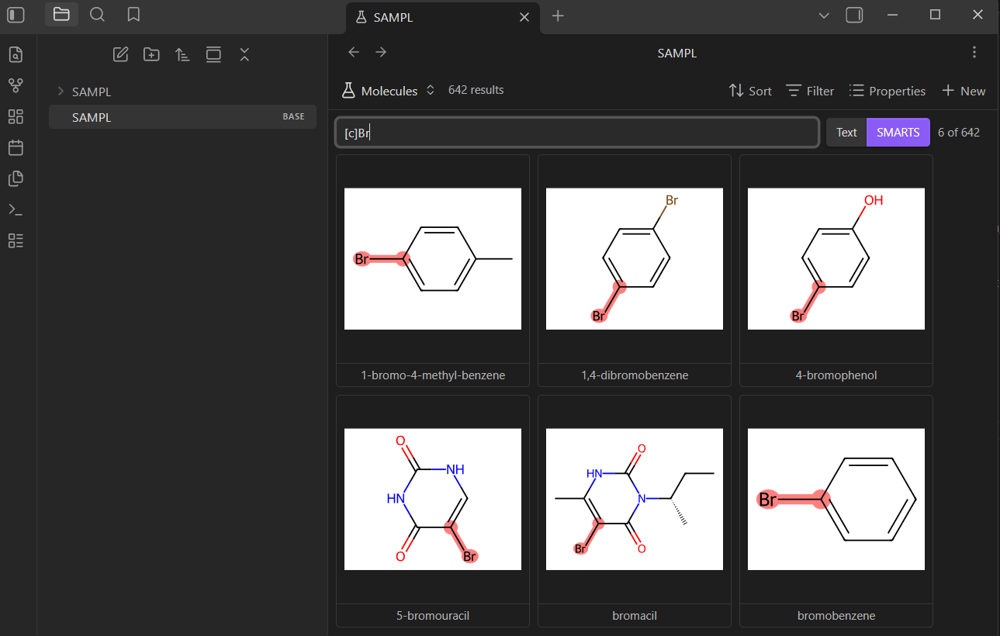
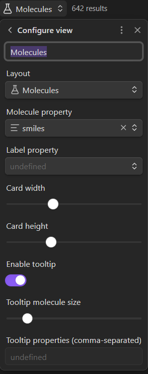

# Mols2Bases

Molecule visualization for [Obsidian Bases](https://obsidian.md/) — render SMILES/MOL structures in a grid view, search by text or SMARTS substructure, and import SDF/CSV files.

Requires Obsidian 1.10.0+.

## Features

- **Molecule Grid View** — Custom Bases view rendering molecular structures as SVG cards via RDKit.js
- **Text & SMARTS Search** — Filter molecules by name/properties or by substructure pattern with match highlighting
- **SDF Import** — Parse SDF files into one-note-per-molecule with YAML frontmatter
- **CSV Import** — Parse CSV files (with a `smiles` column) into notes with frontmatter
- **Rendering Options** — Configurable bond width, transparent background, comic mode, hydrogen removal, coordinate handling
- **Lazy Rendering** — IntersectionObserver-based deferred rendering for large datasets

See [docs/features.md](docs/features.md) for the full list.


## Usage

### 1. Import your data

Open the command palette (`Ctrl/Cmd + P`) and run one of the import commands:



- **Mols2Bases: Import SDF file** — each molecule becomes a note with SMILES (converted via RDKit), MOL block (optional), and all SDF properties stored as YAML frontmatter.
- **Mols2Bases: Import CSV file** — each row becomes a note. The plugin auto-detects the `smiles` column (case-insensitive) and adds all other columns as frontmatter properties.

Both commands create a folder of notes and a `.base` file that ties them together.

> **Note:** The plugin works best with files under ~5,000 compounds. Larger datasets may degrade Obsidian's performance — test with your setup before importing very large files.

### 2. Browse the molecule grid

Open the generated `.base` file. Switch the view layout to **Molecules** — you'll see a grid of SVG-rendered structure cards with labels underneath.



Click any card to open the corresponding note. Hover to see a larger preview with additional properties.

### 3. Search

Use the search bar at the top of the grid:

- **Text mode** — case-insensitive filter across file names and all frontmatter properties.
- **SMARTS mode** — toggle to SMARTS to filter by substructure pattern. Matching atoms and bonds are highlighted directly in the SVGs. A counter shows how many molecules match (e.g. "6 of 642").



### 4. Configure the view

Click the view options button to adjust per-view settings:



- **Molecule property** — which frontmatter field to render (`smiles` by default). Change this if your CSV uses a different column name for molecular structures.
- **Label property** — which field to display as the card label.
- **Card width / height** — adjust card size with sliders.
- **Tooltip** — toggle hover previews and configure which properties to show.

### 5. Plugin settings

Global settings are available under **Settings > Mols2Bases**:

| Setting | Default | Description |
|---------|---------|-------------|
| Remove hydrogens | off | Strip H atoms before rendering |
| Use original coordinates | on | Use input coords; off regenerates 2D layouts |
| Bond line width | 1.0 | Thickness of bonds in depictions |
| Transparent background | off | Remove white background (better for dark themes) |
| Comic mode | off | Hand-drawn style rendering |
| Lazy render | on | Only render molecules when scrolled into view |
| Highlight all SMARTS matches | off | Highlight every match, not just the first |
| Align on SMARTS search | off | Align molecules to matched substructure |
| Search delay | 300ms | Debounce delay for search input |
| Store MOL block | on | Include full MOL block in frontmatter on SDF import |


## Installation

Copy `main.js`, `manifest.json`, `styles.css` into `.obsidian/plugins/mols2bases/` in your vault.

### RDKit WASM

The plugin depends on [RDKit.js](https://github.com/rdkit/rdkit-js) for molecule rendering. On first use, it automatically downloads `RDKit_minimal.js` and `RDKit_minimal.wasm` (~7MB total) from the [unpkg CDN](https://unpkg.com/) and caches them in the plugin directory. Subsequent loads use the cached files with no network required.

## Building from Source

```bash
npm install
npm run build   # production build
npm run dev     # development build with sourcemaps
```

## Acknowledgments

Inspired by [mols2grid](https://github.com/cbouy/mols2grid) by Cédric Bouysset — an interactive molecule viewer for Jupyter notebooks. The grid-based molecule browsing concept, feature ideas like SMARTS filtering with match highlighting, and several planned features in this plugin were directly influenced by mols2grid.

Molecule rendering is powered by [RDKit.js](https://github.com/rdkit/rdkit-js).
